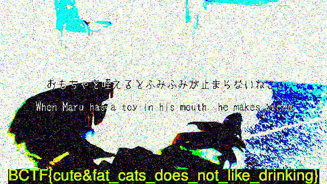

### 题目
 题目是给的一个[mp4](catvideo-497570b7e2811eb52dd75bac9839f19d7bca5ef4.mp4)文件,该文件打开全部都是雪花，无声音，无法看清楚。

S.K同学告诉我转化格式，试过用ffmpeg转化为gif/jpg,但是都无疾而终。仍然是雪花图片。
我在stackoverflow上找到一个转化方式：
`ffmpeg -i catvideo-497570b7e2811eb52dd75bac9839f19d7bca5ef4.mp4 -vf fps=1 out%d.bmp`  加上fps=1这个的好处是转化出来的图片文件数量不多。

赛后看了一些网上的题解，才知道通常这类隐藏数据的方式都是使用某个key和原始数据进行XOR,我开始尝试了Python的PIL库

``` python
from PIL import Image,ImageChops
import glob
im1 = Image.open('out1.bmp')
cnt = 1
for f in glob.glob("out*.bmp"):
	ImageChops.logical_xor(Image.open(f), im1).show()
	if cnt % 10 == 0:
	    raw_input("press key to continue")
	cnt += 1
```

结果函数不可以用在RGB模式上，网上对于`logical_xor`的文档也少的可怜.遍历了我知道的各种格式，发现只支持灰度图，但是XOR出来虽然知道有东西，也看不清楚。
后来在网上找到了这么一个地址:[https://www.cs.hmc.edu/~jlevin/ImageCompare.py](https://www.cs.hmc.edu/~jlevin/ImageCompare.py)

用了其中的XOR搞定。

最后得到的图片大概这样子：



###扩展阅读

+ [http://err0r-451.ru/2016-bctf-forensic-catvideo-150-pts/](http://err0r-451.ru/2016-bctf-forensic-catvideo-150-pts/)
+ [https://github.com/DMArens/CTF-Writeups/tree/master/2016/BCTF/Forensics150](https://github.com/DMArens/CTF-Writeups/tree/master/2016/BCTF/Forensics150)
