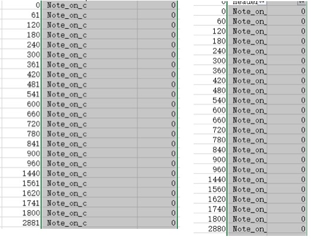
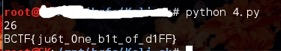
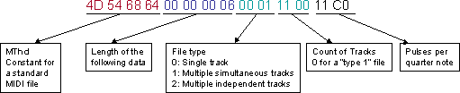

### 题目
 题目是给的一个[mid](midifan.mid.ce4c0b4f4d9833b1c728c622f47b300f)文件,该文件为魂斗罗的音乐。

此题由S.K同学做出。我负责整理为文档继续团队学习。

最开始，使用Python的[python-midi](https://github.com/vishnubob/python-midi)库跑了一遍。
按照好心人提示,可以转化为csv文件以看见channel/延时 等数据。网上下载了midicsv文件,编译之后使用

`midicsv midifan.mid out.csv`

得到CSV文件，和网上找到的原始文件作对比，发现第一列时间里出现轻微的波动，如图(左边题目，右边网上找到的原版文件):



Note_on_c在midi里是midi事件，它本来应该是二进制的数据块
所以根据好心人提示，将奇数的时间转1，偶数转0形成01串，还原 二进制数据
我是先提取这部分数据:
`midicsv midifan.mid | grep "Note_on_c, 0" | cut -d ',' -f 2 >  out.txt`

存到一个.txt文件里，然后写了python的脚本:

```python
import re
import fileinput
text=fileinput.input('out.txt')
for i in text:
 if int(i)%2==0:
  print 0
 else:
  print 1
```
观察发现有许多多余的0，逆序之后这些0岂不是可以去掉了？于是我逆序了这些01串然后转化为16进制最后换字符。终于得到看起来像Flag的东西，没错，还得再逆序一次才可以看得出来。
以下代码精简了一下:

```python
s = "".join(map(lambda x:str(int(x)&1), filter(None, open('out.txt').read().split('\n'))))
print hex(int(s[::-1],2))[2:-1].decode('hex')[::-1]
```
最后得道的结果如下：



###关于MIDI的知识

####概述
---
一个MIDI文件基本上由两个部分组成，头块和轨道块。第二节讲述头块，第三节讲述轨道块。一个MIDI文件有一个头块用来描述文件的格式、许多的轨道块等内容。一个轨道可以想象为像一个大型多音轨录音机那样，你可以为某种声音、某种乐谱、某种乐器或者你需要的任何东西分配一个轨道

####头块
---
头块出现在文件的开头，有三种方式来描述文件。头块看起来一直是这样的：

`4D 54 68 64 00 00 00 06 ff ff nn nn dd dd`

前4个字节等同于ASCII码MThd，接着MThd之后的4个字节是头的大小。它将一直是`00 00 00 00 06`，因为现行的头信息将一直是6字节。

`ff ff`是文件的格式，有3种格式：

> * 0－单轨
> *	1－多规，同步
> *	2－多规，异步

单轨，很显然就只有一个轨道。同步多轨意味着所有轨道都是垂直同步的，或者其他的措辞为他们都在同一时间开始，并且可以表现一首歌的不同部分。异步多轨没有必要同时开始，而且可以完全的不同步。

可以参加下图：



> 图片来源[http://www.codeproject.com/Articles/5390/Steganography-V-Hiding-Messages-in-MIDI-Songs]](http://www.codeproject.com/Articles/5390/Steganography-V-Hiding-Messages-in-MIDI-Songs])

* nn nn 是MIDI文件中的轨道数。
* dd dd 是每个4分音符delta-time节奏数（这之后将做详细介绍）

####轨道块
---

头块之后剩下的文件部分是轨道块。每一个轨道包含一个头，并且可以包含你所希望的许多MIDI命令。轨道头与文件头及其相似：

`4D 54 72 6B xx xx xx xx`

与头一致，前4个字节是ASCII吗，这个是MTrk，紧跟MTrk的4个字节给出了以字节为单位的轨道的长度（不包括轨道头）。

头之下是MIDI事件，这些事件同现行的可以被带有累加的MIDI合成器端口接受和发送的数据是相同的。一个MIDI 事件先于一个delta-time。一个delta-time是一个MIDI事件被执行后的节奏数，每个四分之一音符的节奏数先前已经定义在了文件的头块中。这个delta-time是一个可变长度的编码值。这种格式虽然混乱，可是允许根据需要利用多位表示较大的数值，这不会因为需求小的数值情况下以添零的方式浪费掉一些字节！数值被转换为7位的字节，并且除了最后一个字节以最高有效位是0外，各个字节最有意义的一位是1，。这就允许一个数值被一次一个字节地读取，你如果发现最高有效位是0，则这就是这个数值的最后一位(意义比较小）。依照MIDI说明，全部delta-time的长度最多超过4字节。

delta-time 之后就是MIDI事件，每个MIDI事件（除了正在运行的事件外）带有一个最高有效位总是1的命令字节（值将>128）。大部分命令的列表在附录A中。每个命令都有不同的参数和长度，但是接下来的数据将是最高有效位为零（值将<128）。这里有个例外就是meta-event，最高有效位可以是1。然而，meta-events需要一个长的参数以区分。

微小失误就可以导致混乱的是运行模式，这是现行MIDI命令所忽略的地方，并且最终发行的MIDI命令是假定的。这就意味这如果包含了命令，那么MIDI事件就是由delta-time与参数组成而转换的。

####MIDI事件的读取
---
MIDI消息的种类很丰富，而且没有统一的格式，这意味着只能把每一种消息单独处理。值得庆幸的是，不是所有的MIDI消息都跟五线谱有关，所以要真正理解的MIDI消息实际上不是很多。要面对的最多的消息是音符打开消息(Note-On)，它的实际使用量占了所有消息的总使用量的95%以上。音符关闭消息(Note-Off)也是必须要处理的，如果不处理这种消息，会造成漏音(打开的音符没有对应的关闭信号而一直打开)。
由于MIDI中没有音符的概念，因此要通过将对应的音符开启和关闭事件配对形成一个音符，称之为原始音符，之后还需要将音符开始时间戳和结束时间戳转换成音符开始时间戳和音符持续长度。
为了完成上述两个任务，使用一个大数组缓存16个通道里的128个音的状态。在接收到音符打开与关闭消息时进行记录，并同时计算开始时间与持续时间。

###扩展阅读

+ [http://www.codeproject.com/Articles/5390/Steganography-V-Hiding-Messages-in-MIDI-Songs](http://www.codeproject.com/Articles/5390/Steganography-V-Hiding-Messages-in-MIDI-Songs)
+ [http://www.ccarh.org/courses/253/handout/smf/](http://www.ccarh.org/courses/253/handout/smf/)

